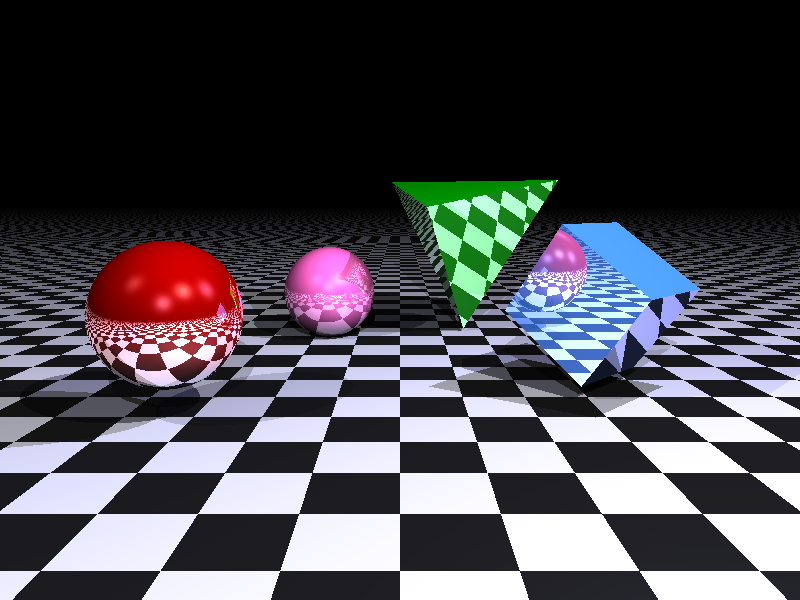

# Python 光线追踪渲染器

一个基于递归光线追踪策略的光线追踪渲染器。

<!-- PROJECT SHIELDS -->
<<<<<<< HEAD
<p align="left">
  
  
  
  
  <a href="LICENSE.txt">
    
  </a>
</p>
=======

[![Stargazers][stars-shield]][stars-url]
[![Issues][issues-shield]][issues-url]
>>>>>>> 2ce7f1920802b03ad0c9e47fbca8456cbd4c4819

<!-- PROJECT LOGO -->
<br />
<p align="center">
  <a href="https://github.com/CUC-ZIHANG-LIU/ray-tracing/">
    
  </a>

  <h3 align="center">Python 光线追踪渲染器</h3>

  <p align="center">
    一个使用Python和Numpy实现的简易光线追踪项目。
    <br />
    <a href="https://github.com/CUC-ZIHANG-LIU/ray-tracing/"><strong>探索本项目的文档 »</strong></a>
    <br />
    <br />
    <a href="#">查看Demo</a>
    ·
    <a href="https://github.com/CUC-ZIHANG-LIU/ray-tracing/issues">报告Bug</a>
    ·
    <a href="https://github.com/CUC-ZIHANG-LIU/ray-tracing/issues">提出新特性</a>
  </p>
</p>

## 目录

- [关于项目](#关于项目)
  - [功能特性](#功能特性)
  - [实现技术](#实现技术)
- [上手指南](#上手指南)
  - [开发前的配置要求](#开发前的配置要求)
  - [安装与运行](#安装与运行)
- [文件目录说明](#文件目录说明)
- [项目架构](#项目架构)
- [版本控制](#版本控制)
- [作者](#作者)
- [版权说明](#版权说明)
- [鸣谢](#鸣谢)

## 关于项目



本项目是一个基于Python的简易光线追踪渲染器。它能够渲染一个包含多种几何形状（球体、立方体、四面体、平面）的3D场景，并应用Phong光照模型来计算光照效果，最终生成一张彩色的2D图像。

### 功能特性
*   支持多种几何体：球体, 立方体, 四面体, 平面
*   实现Phong光照模型 (环境光、漫反射、镜面高光)
*   支持多种自定义材质和多个点光源
*   支持对物体进行旋转等变换
*   可配置的相机 (位置, 朝向, 视场角)
*   使用 `tqdm` 显示渲染进度条
*   渲染结果可保存为 `output.png`

### 实现技术
*   [Python](https://www.python.org/)
*   [NumPy](https://numpy.org/)
*   [Pillow](https://python-pillow.org/)
*   [tqdm](https://github.com/tqdm/tqdm)

## 上手指南

请按照以下说明在本地设置并运行该项目。

### 开发前的配置要求
- Python 3.x
- pip (Python包管理工具)

### 安装与运行

1.  克隆仓库到本地
    ```sh
    git clone https://github.com/your_github_name/your_repository.git
    ```
2.  进入项目代码目录
    ```sh
    cd your_repository/代码文件
    ```
3.  通过 `pip` 安装依赖
    ```sh
    pip install -r requirements.txt
    ```
4.  运行主程序
    ```sh
    python ray_tracer.py
    ```
    程序会开始渲染场景，并显示一个进度条。渲染完成后，你会在 `代码文件` 目录下找到 `output.png`。

## 文件目录说明
项目主要包含在 `代码文件` 目录下：
```
代码文件/
├── ray_tracer.py     # 主程序，负责场景设置、渲染循环和图像输出
├── scene.py          # 定义 Scene 类，管理场景中的所有对象和光源
├── camera.py         # 定义 Camera 类，用于生成光线
├── geometry.py       # 定义各种几何体（球体、立方体等）及其光线求交逻辑
├── material.py       # 定义 Material 类，描述物体的表面属性
├── vector.py         # 定义 Vector3 类，用于三维向量运算
├── requirements.txt  # 项目依赖的Python库
└── output.png        # 默认的渲染输出图像
```

## 项目架构
本项目采用经典的光线追踪算法架构：
1.  **初始化**: `ray_tracer.py` 脚本是程序的入口。它首先会初始化一个 `Scene` 对象，并向其中添加几何体（如 `Sphere`, `Cube`）、材质 (`Material`) 和光源。
2.  **相机设置**: 创建一个 `Camera` 对象，定义其在3D空间中的位置、观察方向和视野范围。
3.  **光线投射**: 程序遍历输出图像的每一个像素点。对于每个像素，`Camera` 会根据其位置和方向计算出一条对应的光线 (`Ray`)。
4.  **光线求交**: `Scene` 对象接收到光线后，会遍历场景中的所有几何体，计算光线与哪个物体相交，并找出最近的交点。各个几何体自身的类 (`geometry.py`) 中定义了具体的求交计算方法。
5.  **颜色计算**: 找到交点后，根据该点所在物体的 `Material` 属性（如颜色、反光度）以及场景中的光源信息，使用 **Phong光照模型** 计算出该点的最终颜色。
6.  **图像生成**: 将计算出的每个像素点的颜色填充到图像中，渲染完成后，使用 `Pillow` 库将最终图像保存为 PNG 文件。

### 版本控制

该项目使用Git进行版本管理。您可以在repository参看当前可用版本。

### 作者

请在此处填写你的信息

### 版权说明

该项目签署了MIT 授权许可，详情请参阅 [LICENSE.txt](LICENSE.txt)

### 鸣谢

- [GitHub Emoji Cheat Sheet](https://www.webpagefx.com/tools/emoji-cheat-sheet)
- [Img Shields](https://shields.io)
- [Choose an Open Source License](https://choosealicense.com)

<<<<<<< HEAD
=======
<!-- links -->
[stars-shield]: https://img.shields.io/github/stars/shaojintian/Best_README_template.svg?style=flat-square
[stars-url]: https://github.com/shaojintian/Best_README_template/stargazers
[issues-shield]: https://img.shields.io/github/issues/shaojintian/Best_README_template.svg?style=flat-square
[issues-url]: https://img.shields.io/github/issues/shaojintian/Best_README_template.svg
[license-shield]: https://img.shields.io/github/license/shaojintian/Best_README_template.svg?style=flat-square
[license-url]: https://github.com/shaojintian/Best_README_template/blob/master/LICENSE.txt

>>>>>>> 2ce7f1920802b03ad0c9e47fbca8456cbd4c4819


